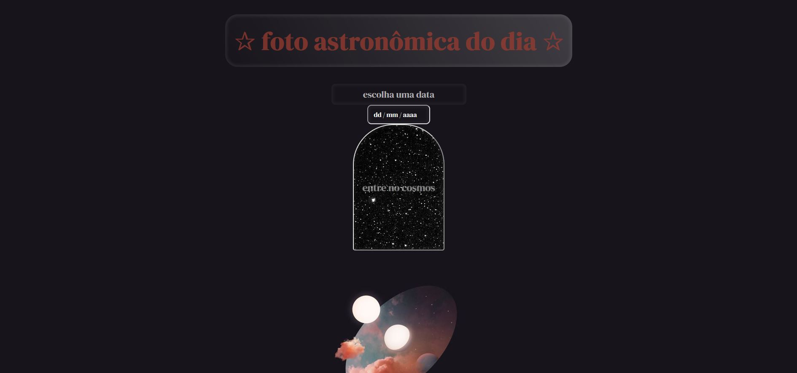
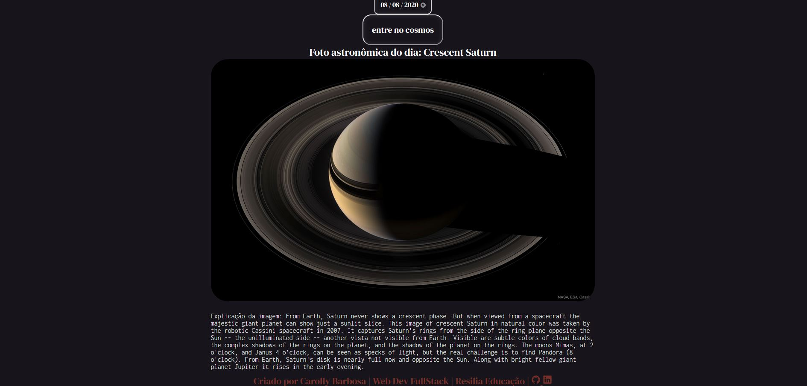

# Projeto APOD - Astronomy Picture of the Day 💫 

### Proposta
###### Aplicação capaz de receber uma data como entrada do usuário a partir de um formulário. Com a data selecionada, ao clicar no botão de envio, uma requisição deve ser enviada à API da APOD para que seja objetida a foto ou vídeo referente ao dia escolhido. A página deve ser manipulada para que os dados retornados sejam devidamente exibidos.

### Contexto
###### A Nasa disponibiliza uma série de API's que fornecem acesso aos seus projetos e sistemas. A "Astronomy Picture of the Day" (APOD) é uma API que fornece uma foto ou vídeo, diariamente, para que as pessoas consigam descobrir um pouco mais sobre o espaço.

### Requisitos:

- [x] Ter um repositório no Github;
- [x] Deve ter uma página disponível no Github Pages;
- [x] Deve utilizar JQuery.

### Tecnologias utilizadas:

  

    
    
  
  
      

### Demonstração

